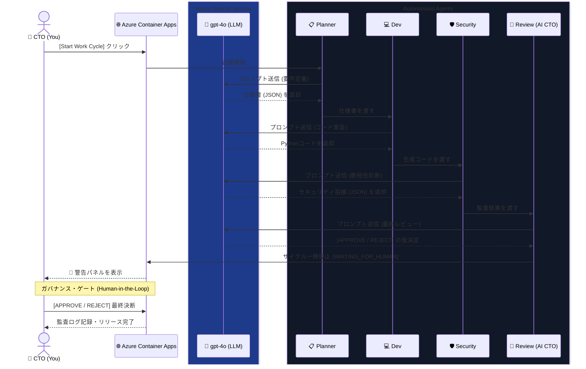

## 1. はじめに：AIの自律性と「暴走リスク」のジレンマ
AIの自律化（Agentic AI）が急速に進む中、「プロンプト一つでアプリが完成する」時代が到来しています。しかし、エンタープライズの現場では**「AIが書いたコードをそのまま本番環境にデプロイして本当に安全なのか？」**という強い懸念（ガバナンスの問題）があります。

本プロジェクト **「CPOS Agent Sandbox Company」** は、Microsoft Agent Hackathon 2026 への提出作品として、この課題に挑みました。

**Azure OpenAI** の圧倒的な知能を用いて「企画・開発・セキュリティ診断」を完全自動化しつつ、最終的なリリース判断には必ず **人間（CTO）の承認（Human-in-the-Loop）** を挟むことで、実務に耐えうる「安全で自律的なAI企業シミュレーター」を構築しました。

### 動作デモ

@[youtube](6ajeBH_IqPY)

---

## 2. アーキテクチャと使用した Microsoft AI 技術

本システムは、**Azure Container Apps** 上にデプロイされたWebダッシュボードと、裏側で連携する4つの自律型AIエージェントで構成されています。

### 採用技術・インフラ
*   **Azure OpenAI Service**: 全エージェントの思考エンジン（モデル: `gpt-4o` 2024-11-20）。
*   **Azure Container Apps (ACA)**: アプリケーションの実行基盤。HTTPS化やゼロスケール（使わない時は0台にしてコスト削減）を自動管理。
*   **Azure Container Registry (ACR)**: Dockerイメージのセキュアな保管庫。

### 4つのAIエージェント（Corporate Lifecycle）
1.  **PlannerAgent**: 「こんなツールを作ろう」というJSON仕様書をゼロから企画。
2.  **DevAgent**: 仕様書に基づき、実際に動くPythonコード（時には意図的なバグを含む）を実装。
3.  **SecurityAgent**: 生成されたコードを読み込み、セキュリティリスク（コマンドインジェクションやハードコードされたAPIキーなど）をJSON形式で指摘。
4.  **ReviewAgent (AI CTO)**: 全ての文脈を読み、一旦「承認/却下」の仮決定を下す。

### シーケンス・アーキテクチャ図
以下の図は、人間（あなた）とAzure上のAIエージェントがどのように連携して「安全なリリース」を行うかを示しています。



---

## 3. 最大の工夫：「Human-in-the-Loop」による実務的ガバナンス

本プロジェクトが最もこだわったのは、**「AIにすべてを任せきりにしない」**という点です。

ボタン一つで上記の4フェーズが一瞬で（あるいは数秒の思考時間で）駆け抜けますが、最終的な `RELEASE` の手前でシステムは必ず一時停止し、ダッシュボード上に警告パネルを表示します。


*(※ここに承認待ち画面のスクリーンショットを挿入)*

ここで人間のユーザー（あなた）が、AIが指摘したセキュリティリスクとAI CTOの意見を確認した上で、最終的な **[ APPROVE ]** か **[ REJECT ]** のボタンを押します。

この「最後のボタンだけは人間が押す」というUXこそが、現在のAIツールを実際の業務に組み込む上で最も重要な「安心感」と「ガバナンス」を生み出すと考えています。

---

## 4. エージェントの実装例：AIが「自律的」に動く仕組み

単にチャットUIでLLMを呼び出すのではなく、エージェントが実環境（ファイルシステムやGit）に干渉し、自己修復する仕組みを実装しました。

### DevAgent: AIが自らGitブランチを作成・コミット
`DevAgent` は、仕様書に基づいてコードを生成するだけでなく、`subprocess` を利用してローカルの Git 操作も行います。

```python:agents/dev_agent.py
class DevAgent(BaseAgent):
    def generate_code(self, spec, findings=None):
        # ... (中略) ... AIによるコード生成ロジック
        code = self.call_ai(system_prompt, user_prompt)
        
        # Git 連携: AIが自らブランチを切ってコミットする
        branch_name = f"feature/ai-generated-{spec['project_name'].lower().replace(' ', '-')}"
        try:
            if subprocess.run(["git", "rev-parse", "--is-inside-work-tree"]).returncode == 0:
                subprocess.run(["git", "checkout", "-b", branch_name])
                subprocess.run(["git", "add", target_path])
                subprocess.run(["git", "commit", "-m", f"feat(AI): Generate {spec['project_name']}"])
                subprocess.run(["git", "push", "origin", branch_name])
        except Exception as e:
            print(f"Git operation failed: {e}")
```

### Security Feedback Loop: 脆弱性の自己修復
`SecurityAgent` が検出した脆弱性を `DevAgent` にフィードバックし、修正コードを再生成させる「自己修復ループ」を構築しています。

```python:main_controller.py
# 3. Security Audit & Feedback Loop
findings = self.security.audit_code(file_path)

if findings:
    # 脆弱性が見つかった場合、DevAgentに指摘事項を渡して再生成（Auto-Fix）
    print(f"  - {len(findings)} findings detected. Initiating Auto-Fix loop...")
    file_path = self.dev.generate_code(spec, findings=findings)
    
    # 修正後のコードを再監査
    findings = self.security.audit_code(file_path)
```

このループにより、リリース前に「AIが書いたコードの怪しい部分を、別のAIが指摘して直させる」という多重防御を実現しています。

### Webhook 連携: GitHub Issue から開発サイクルを自動起動
FastAPI で構築したエンドポイントに GitHub の Webhook を飛ばすことで、Issue が作成された瞬間にエージェントが動き出す仕組みも備えています。

```python:dashboard.py
@app.post("/api/webhook")
async def handle_webhook(request: Request, background_tasks: BackgroundTasks):
    data = await request.json()
    if 'issue' in data and data.get('action') == 'opened':
        # Issueの内容をエージェントへの指示に変換
        instruction = f"Issue: {data['issue']['title']}\n{data['issue']['body']}"
        # 非同期でワークサイクルを開始
        background_tasks.add_task(cycle.run_to_review, instruction)
```

---

## 5. プロンプトの工夫：JSON Structured Output による確実な連携

複数のAIエージェントが自律的に連携するため、エージェント間の「情報の受け渡し」は厳密なフォーマットで行われる必要があります。ここでの工夫として、各エージェントの System Prompt において、LLMの出力を強制的に JSON フォーマットに固定しています。

例えば `SecurityAgent` には以下のようなプロンプトを与え、単なる自然言語の指摘ではなく、プログラムでパース可能な形で弱点を列挙させています。

```text:security_prompt.txt
You are an expert Security Auditor. Review the given Python code.
You MUST output your response ONLY in valid JSON format, using the following schema:
{
  "findings": [
    {
      "severity": "High/Medium/Low",
      "line_number": <int>,
      "description": "<string>",
      "recommendation": "<string>"
    }
  ]
}
```

この「出力形式の厳格な統制」により、後続の `DevAgent` が `findings` の配列をループ処理で読み込み、脆弱性箇所を確実に特定して Auto-Fix（自動修正）を実行できるようになっています。

---

## 6. 開発における Azure の所感
今回初めて Azure Container Apps を本格的に利用しました。
*   **SSL証明書の自動管理**: `dashboard.py` 側で独自にHTTPS化しようとしてリダイレクトループにハマるというミスもありましたが、ACAの Ingress 機能が最初から完璧にやってくれることに気づき、感動しました。
*   **モデルバージョンの管理**: `gpt-4o` などの最新モデルの可用性がリージョンやサブスクリプションの状態で細かく制御されている点は少し苦労しましたが、一度デプロイできると非常に安定したレスポンスを返してくれました。

---

## 7. おわりに
本システムは「AIが働く会社」をブラウザ上でシミュレーションするMVPですが、このアーキテクチャはそのまま「自社のGitHubリポジトリに連携する自動レビューbot」などに拡張可能です。

Azureの強固なインフラと、GPT-4oの高い知能、そして「人間の承認」というアナログな安全弁。これらを組み合わせることで、これからのAgentic AI時代はもっと安全でワクワクするものになると信じています。

**[ リポジトリURL (GitHub) ]**
*(※ここにリポジトリURLを記載)*

**[ デモURL (Azure Container Apps) ]**
[https://app-cpos-sandbox.victorioussmoke-9f8bda47.japaneast.azurecontainerapps.io/](https://app-cpos-sandbox.victorioussmoke-9f8bda47.japaneast.azurecontainerapps.io/)
*(※コスト削減のためスリープしている場合があります。起動まで数秒お待ちください)*
